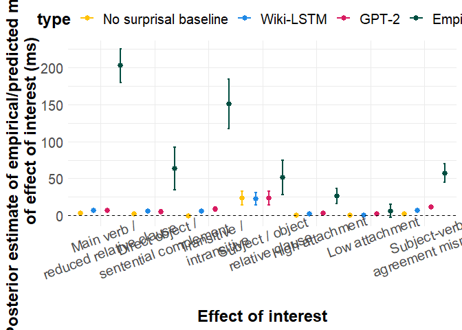
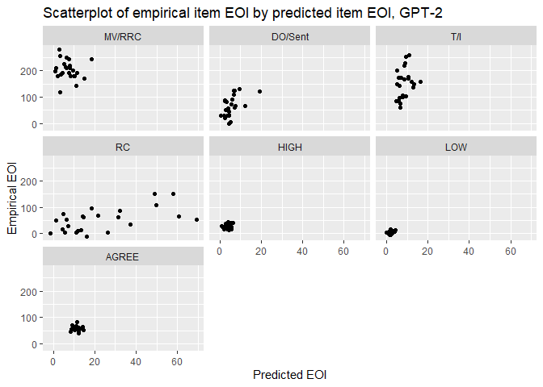

Plots for SAP Benchmark
================

## Load in relevant data

#### BRMS models

``` r
subsets <- c('ClassicGP', 'RelativeClause', 'AttachmentAmbiguity','Agreement')

by_item <-list()
by_construction <-list()

i <- 1
for(s in subsets){
  print(s)
  curr_item <- readRDS(paste0('./', s, '/by_item.rds')) %>%
    mutate(ROI = as.character(ROI)) %>%
    select(item, ROI, coef, mean, lower, upper)  #make sure everything has same order
  curr_item_gpt2 <- readRDS(paste0('./', s, '/by_item_gpt2.rds')) %>%
    mutate(ROI = as.character(ROI)) %>%
    select(item, ROI, coef, mean) %>%
    rename(mean_gpt2 = mean)
  curr_item <- merge(curr_item, curr_item_gpt2, by=c('item', 'ROI', 'coef'), all.x = TRUE)
  curr_item_lstm <- readRDS(paste0('./', s, '/by_item_lstm.rds')) %>%
    mutate(ROI = as.character(ROI)) %>%
    select(item, ROI, coef, mean) %>%
    rename(mean_lstm = mean)
  curr_item <- merge(curr_item, curr_item_lstm, by=c('item', 'ROI', 'coef'), all.x = TRUE)
  curr_item_nosurp <- readRDS(paste0('./', s, '/by_item_nosurp.rds')) %>%
    mutate(ROI = as.character(ROI)) %>%
    select(item, ROI, coef, mean) %>%
    rename(mean_nosurp = mean)
  curr_item <- merge(curr_item, curr_item_nosurp, by=c('item', 'ROI', 'coef'), all.x = TRUE)
  by_item[[i]] <- curr_item
  
  ## By construction
  
  curr_construction <- readRDS(paste0('./', s, '/by_construction.rds')) %>%
    mutate(ROI = as.character(ROI),
    type = 'Empirical') %>%
    select(ROI, coef, mean, lower, upper, type)  #make sure everything has same order
  curr_construction_gpt2 <- readRDS(paste0('./', s, '/by_construction_gpt2.rds'))%>%
    mutate(ROI = as.character(ROI),
    type = 'GPT2') %>%
    select(ROI, coef, mean, lower, upper, type)
  curr_construction <- dplyr::bind_rows(curr_construction, curr_construction_gpt2)
  curr_construction_lstm <- readRDS(paste0('./', s, '/by_construction_lstm.rds')) %>%
    mutate(ROI = as.character(ROI),
    type = 'LSTM') %>%
    select(ROI, coef, mean, lower, upper, type)
  curr_construction <- dplyr::bind_rows(curr_construction, curr_construction_lstm)
  curr_construction_nosurp <- readRDS(paste0('./', s, '/by_construction_nosurp.rds')) %>%
    mutate(ROI = as.character(ROI),
    type = 'nosurp') %>%
    select(ROI, coef, mean, lower, upper, type)
  curr_construction <- dplyr::bind_rows(curr_construction, curr_construction_nosurp)
  by_construction[[i]] <- curr_construction
  i <- i+1
}
```

    ## [1] "ClassicGP"
    ## [1] "RelativeClause"
    ## [1] "AttachmentAmbiguity"
    ## [1] "Agreement"

``` r
by_item <- dplyr::bind_rows(by_item)
by_construction <- dplyr::bind_rows(by_construction)
```

## Plot 1: By item variance across EOIs

``` r
by_item_ROI_summ <- by_item %>%
  group_by(ROI, coef) %>%
  summarise(mean = mean(mean)) %>%
  ungroup() %>%
  group_by(coef) %>%
  mutate(max = max(mean),
         max_ROI = ifelse(max == mean, TRUE, FALSE)) %>%
  select(ROI, coef, max_ROI)
```

    ## `summarise()` has grouped output by 'ROI'. You can override using the `.groups`
    ## argument.

``` r
x <- by_item_ROI_summ %>%
  filter(max_ROI)
  
  
by_item <- merge(by_item, by_item_ROI_summ, by=c('ROI', 'coef')) %>%
  group_by(coef, ROI) %>%
  mutate(item = reorder_within(item, mean, coef),
         rank = rank(mean),
         greater_than_zero = ifelse(lower > 0, TRUE, FALSE),
         coef = factor(coef, levels = c('GPE_NPS', 'GPE_MVRR', 'GPE_NPZ', 'GPE','Agr', 'GPE_low', 'GPE_high', 'RC')))
```

``` r
by_item$EOI <- factor(by_item$coef,levels=c("GPE_MVRR","GPE_NPS","GPE_NPZ","RC","GPE_high","GPE_low","Agr"),labels=c("MV/RRC","DO/Sent","T/I","RC","HIGH","LOW","AGREE"))
by_construction$EOI <- factor(by_construction$coef,levels=c("GPE_MVRR","GPE_NPS","GPE_NPZ","RC","GPE_high","GPE_low","Agr"),labels=c("MV/RRC","DO/Sent","T/I","RC","HIGH","LOW","AGREE"))


EOI.labs <- c("MV/RRC"="Main verb / reduced relative clause","DO/Sent"="Direct object / sentential complement","T/I"="Transitive / intransitive","RC"="Subject / object relative clause","HIGH"="High attachment","LOW"="Low attachment","AGREE"="Subject-verb agreement mismatch")


CoV_labels <- data.frame(EOI=c("MV/RRC","DO/Sent","T/I","RC","HIGH","LOW","AGREE"),label = c("CoV=.181", "CoV=.610", "CoV=.368","CoV=.869","CoV=.343","CoV=.891","CoV=.177"))


ggplot(by_item %>%
         filter(max_ROI),
       aes(x = rank, y = mean, alpha = greater_than_zero)) + 
  geom_point(size=3)+
  geom_errorbar(aes(ymin=lower,
                    ymax=upper),
                width=0.7,size=1.2) +
  facet_wrap(~EOI, nrow=2, labeller=labeller(EOI=EOI.labs))  + 
  geom_hline(yintercept=0, linetype = 'dashed')+
  scale_alpha_manual(values=c(0.25, 1)) + theme_bw()+
  theme(
      axis.text.x = element_blank(),
         axis.ticks.x = element_blank(),
        legend.position = 'none',
      strip.text.x = element_text(size = 15), axis.title.y = element_text(size=18,face="bold"),
      axis.title.x = element_text(size=18,face="bold"),
      axis.text.y=element_text(size=15)) + 
  labs(x = 'Item (sorted by effect magnitude)', y = 'Posterior estimate of magnitude of effect of interest (ms)')
```

<!-- -->

``` r
ggsave('./pdfs/by-item-all-eoi.pdf', width=15,height=7)


#empirical coefficients of variation
sd(by_item[by_item$max_ROI==TRUE&by_item$EOI=="MV/RRC",]$mean)/by_construction[by_construction$ROI==1&by_construction$EOI=="MV/RRC"&by_construction$type=="Empirical",]$mean
```

    ## [1] 0.1808675

``` r
sd(by_item[by_item$max_ROI==TRUE&by_item$EOI=="DO/Sent",]$mean)/by_construction[by_construction$ROI==1&by_construction$EOI=="DO/Sent"&by_construction$type=="Empirical",]$mean
```

    ## [1] 0.609848

``` r
sd(by_item[by_item$max_ROI==TRUE&by_item$EOI=="T/I",]$mean)/by_construction[by_construction$ROI==1&by_construction$EOI=="T/I"&by_construction$type=="Empirical",]$mean
```

    ## [1] 0.3684773

``` r
sd(by_item[by_item$max_ROI==TRUE&by_item$EOI=="RC",]$mean)/by_construction[by_construction$ROI==0&by_construction$EOI=="RC"&by_construction$type=="Empirical",]$mean
```

    ## [1] 0.8691791

``` r
sd(by_item[by_item$max_ROI==TRUE&by_item$EOI=="HIGH",]$mean)/by_construction[by_construction$ROI==1&by_construction$EOI=="HIGH"&by_construction$type=="Empirical",]$mean
```

    ## [1] 0.3428211

``` r
sd(by_item[by_item$max_ROI==TRUE&by_item$EOI=="LOW",]$mean)/by_construction[by_construction$ROI==0&by_construction$EOI=="LOW"&by_construction$type=="Empirical",]$mean
```

    ## [1] 0.890831

``` r
sd(by_item[by_item$max_ROI==TRUE&by_item$EOI=="AGREE",]$mean)/by_construction[by_construction$ROI==1&by_construction$EOI=="AGREE"&by_construction$type=="Empirical",]$mean
```

    ## [1] 0.1768064

## Plot 2: Construction level effects

``` r
by_const_maxROIs <- by_construction %>%
  filter(type == 'Empirical') %>%
  group_by(coef) %>%
  mutate(max = max(mean),
         max_ROI = ifelse(max == mean, TRUE, FALSE)) %>%
  ungroup() %>%
  select(coef, ROI, max_ROI)


by_construction <- merge(by_construction, by_const_maxROIs, by = c('coef', 'ROI')) %>%
         mutate(EOI = factor(coef, levels = c('GPE_MVRR', 'GPE_NPS', 'GPE_NPZ', 'RC', 'GPE_high', 'GPE_low','Agr'),labels=c("Main verb /\n reduced relative clause","Direct object /\n sentential complement","Transitive / intransitive","Subject / object \nrelative clause","High attachment","Low attachment","Subject-verb\n agreement mismatch")))


by_construction$type <- factor(by_construction$type,levels=c("nosurp","LSTM","GPT2","Empirical"),labels=c("No surprisal baseline","Wiki-LSTM","GPT-2","Empirical"))

ggplot(by_construction %>%
         filter(max_ROI), aes(x=EOI, y=mean, color=type))+
  geom_point(size=2.5,position = position_dodge(width=1))+ylab("Posterior estimate of empirical/predicted magnitude\n of effect of interest (ms)")+
  geom_errorbar(aes(ymin=lower,
                     ymax=upper),
                 position = position_dodge(width = 1),
                 width = 0.2,size=1)+xlab("Effect of interest")+
  scale_color_manual(labels = c('No surprisal baseline','Wiki-LSTM','GPT-2','Empirical'),values = c("#FFC107","#1E88E5","#D81B60","#004D40"))+
  scale_x_discrete(labels=c("Main verb /\n reduced relative clause","Direct object /\n sentential complement","Transitive /\n intransitive","Subject / object \nrelative clause","High attachment","Low attachment","Subject-verb\n agreement mismatch","Filler"))+ theme_minimal()+theme(legend.position="top", legend.box = "horizontal",legend.text = element_text(size=15), legend.title = element_text(size=18,face="bold"),
  axis.title.y = element_text(size=18,face="bold"),
      axis.title.x = element_text(size=18,face="bold"),
      axis.text.y=element_text(size=15),
  axis.text.x=element_text(size=15, angle = 20))+
    geom_hline(yintercept = 0, linetype='dashed')
```

<!-- -->

``` r
ggsave('./pdfs/by-construction-emp-surp.pdf', width=15,height=7)
```

``` r
ggplot(by_item[by_item$max_ROI==TRUE,], aes(x=mean_lstm, y=mean)) + 
  geom_point() + 
  facet_wrap(~EOI)+
  labs(title="Scatterplot of empirical item EOI by predicted item EOI, Wikitext LSTM",
        x ="Predicted EOI", y = "Empirical EOI")
```

<!-- -->

``` r
ggplot(by_item[by_item$max_ROI==TRUE,], aes(x=mean_gpt2, y=mean)) + 
  geom_point() + 
  facet_wrap(~EOI)+
  labs(title="Scatterplot of empirical item EOI by predicted item EOI, GPT-2",
        x ="Predicted EOI", y = "Empirical EOI")
```

<!-- -->

``` r
ggplot(by_item[by_item$max_ROI==TRUE,], aes(x=mean_nosurp, y=mean)) + 
  geom_point() + 
  facet_wrap(~EOI)+
  labs(title="Scatterplot of empirical item EOI by predicted item EOI, No surprisal baseline",
        x ="Predicted EOI", y = "Empirical EOI")
```

<!-- -->

``` r
noise.summary <- read.csv("noiseceiling_summary.csv") %>%
  gather("Effect","Correlation",2:9) %>%
  rename("EOI" = Effect,
         "Ceiling" = Correlation)

GP.data <- readRDS("correlation/sampled_correlations_maxregion_GP.rds")
RC.data <- readRDS("correlation/sampled_correlations_maxregion_RC.rds")
AA.data <- readRDS("correlation/sampled_correlations_maxregion_AA.rds")
Agr.data <- readRDS("correlation/sampled_correlations_maxregion_Agr.rds")

all.data <- rbind(GP.data,RC.data,AA.data,Agr.data) %>% left_join(noise.summary)
```

    ## Joining, by = c("EOI", "ROI")

``` r
cor.summary <- all.data %>%
                group_by(EOI,model) %>%
                summarize(
                  mean = mean(Correlation),
                  ceiling = mean(Ceiling),
                  lower.25 = quantile(Correlation,.25),
                  lower.10 = quantile(Correlation,.10),
                  lower.025 = quantile(Correlation,.025),
                  upper.75 = quantile(Correlation,.75),
                  upper.90 = quantile(Correlation,.90),
                  upper.975 = quantile(Correlation,.975)
                ) %>%
                rename("Model" = model)
```

    ## `summarise()` has grouped output by 'EOI'. You can override using the `.groups`
    ## argument.

``` r
filler_results <- read.csv("correlation/3 models filler.csv",header=T)
filler_summary <- data.frame(EOI="Filler",Model=c("lstm","gpt2","nosurp"),mean=NA,ceiling=0.99,lower.25=NA,lower.10=NA,lower.025=NA,upper.75=NA,upper.90=NA,upper.975=NA)
for(i in 2:ncol(filler_results)){
  filler_summary[i-1,'mean'] <- mean(filler_results[,i])
  filler_summary[i-1,'lower.025'] <- mean(filler_results[,i])-1.96*sd(filler_results[,i])
  filler_summary[i-1,'upper.975'] <- mean(filler_results[,i])+1.96*sd(filler_results[,i])
  filler_summary[i-1,'lower.10'] <- mean(filler_results[,i])-1.283*sd(filler_results[,i])
  filler_summary[i-1,'upper.90'] <- mean(filler_results[,i])+1.283*sd(filler_results[,i])
  filler_summary[i-1,'lower.25'] <- mean(filler_results[,i])-0.675*sd(filler_results[,i])
  filler_summary[i-1,'upper.75'] <- mean(filler_results[,i])+0.675*sd(filler_results[,i])
}
cor.summary <- rbind(cor.summary,filler_summary)
cor.summary$EOI <- factor(cor.summary$EOI, levels = c("GPE_MVRR","GPE_NPS","GPE_NPZ","RC","GPE_high","GPE_low","Agr","Filler") )
cor.summary$Model <- factor(cor.summary$Model,levels = c("nosurp","lstm","gpt2"))
cor.summary <- cor.summary[!is.na(cor.summary$Model),]

ggplot(cor.summary, aes(x=EOI, y=mean, color=Model))+
  geom_rect(inherit.aes=FALSE,
            aes(xmin=as.numeric(EOI)-.25,xmax=as.numeric(EOI)+0.25,ymin=0,ymax=ceiling), alpha=0.1)+
  geom_linerange(aes(ymin=lower.025,ymax=upper.975),lwd=0.5,position = position_dodge(width=.5))+
  geom_linerange(aes(ymin=lower.25,ymax=upper.75),lwd=1.75,position = position_dodge(width=.5))+
  geom_point(lwd=4,position = position_dodge(width=.5))+
  ylim(-.45,1)+ylab("Correlation between model predictions and data")+xlab("Effect of Interest")+
  scale_color_manual(labels = c('No surprisal baseline','Wiki-LSTM','GPT-2'),values = c("#FFC107","#1E88E5","#D81B60"))+
  scale_x_discrete(labels=c("Main verb /\n reduced relative clause","Direct object /\n sentential complement","Transitive /\n intransitive","Subject / object \nrelative clause","High attachment","Low attachment","Subject-verb\n agreement mismatch","Filler"))+ theme_minimal()+theme(legend.position="top", legend.box = "horizontal",legend.text = element_text(size=15), legend.title = element_text(size=18,face="bold"),
  axis.title.y = element_text(size=18,face="bold"),
      axis.title.x = element_text(size=18,face="bold"),
      axis.text.y=element_text(size=15),
  axis.text.x=element_text(size=15, angle = 20, hjust = 0.8))+
  geom_text(x=1.4, y=1, size=5, family = 'sans',inherit.aes = FALSE, label="Maximal explainable variance")+
  geom_segment(inherit.aes = FALSE, x = 1, y = 0.98, xend = 1, yend = .82, arrow = arrow(length = unit(0.2,"cm")))
```

<!-- -->

``` r
ggsave('./pdfs/by-item-emp-pred-cor.pdf', width=15,height=7)
```

``` r
GP_by_item <- cbind(readRDS("ClassicGP/by_item.rds"),
                  unamb_mean=readRDS("ClassicGP/by_item_unamb.rds")[,4])
GP_by_item$EOI <- factor(GP_by_item$coef,levels=c("GPE_MVRR","GPE_NPS","GPE_NPZ"),labels=c("MV/RR","DO/Sent","T/I"))
baselinevsEOI_GP <- GP_by_item %>% group_by(ROI,EOI) %>% do(CORR=cor.test(.$mean,.$unamb_mean))
ggplot(GP_by_item,aes(x=unamb_mean,y=mean))+
  facet_wrap(ROI~EOI)+
  geom_point()+
  geom_smooth(method="lm",formula=y~x)+
  labs(y="EOI size",x="Unambiguous mean RT")
```

<!-- -->

``` r
for(i in 1:nrow(baselinevsEOI_GP)){
  print(c(baselinevsEOI_GP[i,'ROI'][[1]],as.character(baselinevsEOI_GP[i,'EOI'][[1]]),round(baselinevsEOI_GP[i,'CORR'][[1]][[1]]$estimate,3)))
}
```

    ##                     cor 
    ##     "0" "MV/RR" "0.172" 
    ##                           cor 
    ##       "0" "DO/Sent"   "0.377" 
    ##                     cor 
    ##     "0"   "T/I" "0.022" 
    ##                     cor 
    ##     "1" "MV/RR" "0.285" 
    ##                           cor 
    ##       "1" "DO/Sent"   "0.101" 
    ##                     cor 
    ##     "1"   "T/I" "0.216" 
    ##                     cor 
    ##     "2" "MV/RR" "0.339" 
    ##                           cor 
    ##       "2" "DO/Sent"   "0.446" 
    ##                     cor 
    ##     "2"   "T/I" "0.192"

``` r
RC_by_item <- cbind(readRDS("RelativeClause/by_item.rds"),
                    SRC_mean=readRDS("RelativeClause/by_item_SRC.rds")[,4])
RC_by_item$EOI <- factor(RC_by_item$coef,levels=c("RC"),labels=c("RC"))
baselinevsEOI_RC <- RC_by_item %>% group_by(ROI,EOI) %>% do(CORR=cor.test(.$mean,.$SRC_mean))
ggplot(RC_by_item,aes(x=SRC_mean,y=mean))+
  facet_wrap(ROI~EOI,nrow=3)+
  geom_point()+
  geom_smooth(method="lm",formula=y~x)+
  labs(y="EOI size",x="SRC mean RT")
```

<!-- -->

``` r
for(i in 1:nrow(baselinevsEOI_RC)){
  print(c(baselinevsEOI_RC[i,'ROI'][[1]],as.character(baselinevsEOI_RC[i,'EOI'][[1]]),round(baselinevsEOI_RC[i,'CORR'][[1]][[1]]$estimate,3)))
}
```

    ##                     cor 
    ##     "0"    "RC" "0.279" 
    ##                     cor 
    ##     "1"    "RC" "0.085" 
    ##                        cor 
    ##      "2"     "RC" "-0.032"

``` r
AA_by_item <- cbind(readRDS("AttachmentAmbiguity/by_item.rds"),
                    multi_mean=readRDS("AttachmentAmbiguity/by_item_multi.rds")[,4])
AA_by_item$EOI <- factor(AA_by_item$coef,levels=c("GPE_high","GPE_low"),labels=c("HIGH","LOW"))
baselinevsEOI_AA <- AA_by_item %>% group_by(ROI,EOI) %>% do(CORR=cor.test(.$mean,.$multi_mean))
ggplot(AA_by_item,aes(x=multi_mean,y=mean))+
  facet_wrap(ROI~EOI,nrow=3)+
  geom_point()+
  geom_smooth(method="lm",formula=y~x)+
  labs(y="EOI size",x="MultiAttachment mean RT")
```

<!-- -->

``` r
for(i in 1:nrow(baselinevsEOI_AA)){
  print(c(baselinevsEOI_AA[i,'ROI'][[1]],as.character(baselinevsEOI_AA[i,'EOI'][[1]]),round(baselinevsEOI_AA[i,'CORR'][[1]][[1]]$estimate,3)))
}
```

    ##                     cor 
    ##     "0"  "HIGH" "0.104" 
    ##                        cor 
    ##      "0"    "LOW" "-0.202" 
    ##                     cor 
    ##     "1"  "HIGH" "0.434" 
    ##                        cor 
    ##      "1"    "LOW" "-0.243" 
    ##                     cor 
    ##     "2"  "HIGH" "0.178" 
    ##                     cor 
    ##     "2"   "LOW" "-0.18"

``` r
Agr_by_item <- cbind(readRDS("Agreement/by_item.rds"),
                    Agreed_mean=readRDS("Agreement/by_item_Agreed.rds")[,4])
Agr_by_item$EOI <- factor(Agr_by_item$coef,levels=c("Agr"),labels=c("AGREE"))
baselinevsEOI_Agr <- Agr_by_item %>% group_by(ROI,EOI) %>% do(CORR=cor.test(.$mean,.$Agreed_mean))
ggplot(Agr_by_item,aes(x=Agreed_mean,y=mean))+
  facet_wrap(ROI~EOI,nrow=3)+
  geom_point()+
  geom_smooth(method="lm",formula=y~x)+
  labs(y="EOI size",x="Grammatical mean RT")
```

<!-- -->

``` r
for(i in 1:nrow(baselinevsEOI_Agr)){
  print(c(baselinevsEOI_Agr[i,'ROI'][[1]],as.character(baselinevsEOI_Agr[i,'EOI'][[1]]),round(baselinevsEOI_Agr[i,'CORR'][[1]][[1]]$estimate,3)))
}
```

    ##                     cor 
    ##     "0" "AGREE" "0.444" 
    ##                        cor 
    ##      "1"  "AGREE" "-0.138" 
    ##                     cor 
    ##     "2" "AGREE"  "0.25"
