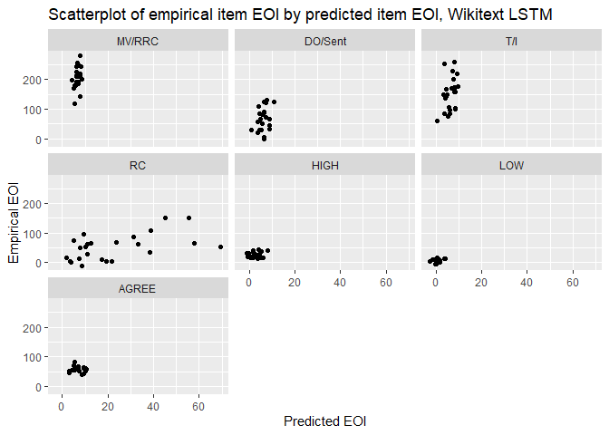

Plots for SAP Benchmark
================

## Load in relevant data

``` r
subsets <- c('GardenPath', 'RelativeClause', 'AttachmentAmbiguity','Agreement')
#subsets <- c('GardenPath', 'RelativeClause', 'Agreement')

by_item <-list()
by_construction <-list()

i <- 1
for(s in subsets){
  print(s)
  
  ## By item
  
   if(file.exists(paste0('./', s, '/by_item.rds'))){
    curr_item <- readRDS(paste0('./', s, '/by_item.rds')) %>%
      mutate(ROI = as.character(ROI)) %>%
      select(item, ROI, coef, mean, lower, upper)  #make sure everything has same order
  
    if(file.exists(paste0('./', s, '/by_item_gpt2.rds'))){
      curr_item_gpt2 <- readRDS(paste0('./', s, '/by_item_gpt2.rds')) %>%
        mutate(ROI = as.character(ROI)) %>%
        select(item, ROI, coef, mean) %>%
        rename(mean_gpt2 = mean)
      
      curr_item <- merge(curr_item, curr_item_gpt2, by=c('item', 'ROI', 'coef'), all.x = TRUE)
    }
     else{
      curr_item$mean_gpt2 <- rnorm(nrow(curr_item), 0, 1)  # ADDS RANDOM NUMBERS TO TEST CODE
    }
    
    if(file.exists(paste0('./', s, '/by_item_lstm.rds'))){
      curr_item_lstm <- readRDS(paste0('./', s, '/by_item_lstm.rds')) %>%
        mutate(ROI = as.character(ROI)) %>%
        select(item, ROI, coef, mean) %>%
        rename(mean_lstm = mean)
      
      curr_item <- merge(curr_item, curr_item_lstm, by=c('item', 'ROI', 'coef'), all.x = TRUE)
    }
     else{
      curr_item$mean_lstm <- rnorm(nrow(curr_item), 0, 1) # ADDS RANDOM NUMBERS TO TEST CODE
    }
    
    by_item[[i]] <- curr_item
  
   }
  
  ## By construction
  
   if(file.exists(paste0('./', s, '/by_construction.rds'))){
    curr_construction <- readRDS(paste0('./', s, '/by_construction.rds')) %>%
      mutate(ROI = as.character(ROI),
             type = 'Empirical') %>%
      select(ROI, coef, mean, lower, upper, type)  #make sure everything has same order
  
    if(file.exists(paste0('./', s, '/by_construction_gpt2.rds'))){
      curr_construction_gpt2 <- readRDS(paste0('./', s, '/by_construction_gpt2.rds'))%>%
        mutate(ROI = as.character(ROI),
             type = 'GPT2') %>%
      select(ROI, coef, mean, lower, upper, type)
      
      curr_construction <- dplyr::bind_rows(curr_construction, curr_construction_gpt2)
      
    }
    
    if(file.exists(paste0('./', s, '/by_construction_lstm.rds'))){
      curr_construction_lstm <- readRDS(paste0('./', s, '/by_construction_lstm.rds')) %>%
        mutate(ROI = as.character(ROI),
             type = 'LSTM') %>%
      select(ROI, coef, mean, lower, upper, type)
      
      curr_construction <- dplyr::bind_rows(curr_construction, curr_construction_lstm)
    }
    
    by_construction[[i]] <- curr_construction
  
   }
  i <- i+1
}
```

    ## [1] "GardenPath"
    ## [1] "RelativeClause"
    ## [1] "AttachmentAmbiguity"
    ## [1] "Agreement"

``` r
by_item <- dplyr::bind_rows(by_item)
by_construction <- dplyr::bind_rows(by_construction)
```

## Plot 1: By item variance across subsets

``` r
by_item_ROI_summ <- by_item %>%
  group_by(ROI, coef) %>%
  summarise(mean = mean(mean)) %>%
  ungroup() %>%
  group_by(coef) %>%
  mutate(max = max(mean),
         max_ROI = ifelse(max == mean, TRUE, FALSE)) %>%
  select(ROI, coef, max_ROI)
```

    ## `summarise()` has grouped output by 'ROI'. You can override using the `.groups` argument.

``` r
x <- by_item_ROI_summ %>%
  filter(max_ROI)
  
  
by_item <- merge(by_item, by_item_ROI_summ, by=c('ROI', 'coef')) %>%
  group_by(coef, ROI) %>%
  mutate(item = reorder_within(item, mean, coef),
         rank = rank(mean),
         greater_than_zero = ifelse(lower > 0, TRUE, FALSE),
         coef = factor(coef, levels = c('GPE_NPS', 'GPE_MVRR', 'GPE_NPZ', 'GPE','Agr', 'GPE_low', 'GPE_high', 'RC')))
```

``` r
ggplot(by_item %>%
         filter(max_ROI) %>%
         filter(coef != 'GPE'),
       aes(x = rank, y = mean, alpha = greater_than_zero)) + 
  geom_point() +
  geom_errorbar(aes(ymin=lower,
                    ymax=upper),
                width=0.3) +
  facet_wrap(~coef, nrow=2)  + 
  geom_hline(yintercept=0, linetype = 'dashed') + 
  scale_alpha_manual(values=c(0.25, 1)) +
  theme(
    # axis.text.x = element_blank(),
    #     axis.ticks.x = element_blank(),
        legend.position = 'none') + 
  labs(x = 'Magnitude Rank', y = 'Effect of Interest')
```

<!-- -->

``` r
ggsave('by-item-all-eoi.pdf', width=6,height=4)
```

## Plot 2: Construction level effects

``` r
by_const_maxROIs <- by_construction %>%
  filter(type == 'Empirical') %>%
  group_by(coef) %>%
  mutate(max = max(mean),
         max_ROI = ifelse(max == mean, TRUE, FALSE)) %>%
  ungroup() %>%
  select(coef, ROI, max_ROI)


by_construction <- merge(by_construction, by_const_maxROIs, by = c('coef', 'ROI')) %>%
         mutate(coef = factor(coef, levels = c('GPE_NPS', 'GPE_MVRR', 'GPE_NPZ', 
                                               'GPE','Agr', 'GPE_low', 'GPE_high', 'RC')))
```

``` r
ggplot(by_construction %>%
         filter(max_ROI) %>%
         filter(coef != 'GPE'), 
       aes(y =coef, x= mean, colour = type, shape = type)) + 
  geom_point(position = position_dodge(width = 0.9)) + 
  geom_errorbarh(aes(xmin=lower,
                     xmax=upper),
                 position = position_dodge(width = 0.9),
                 width = 0.2) + 
  labs(x = 'Mean magnitude of effect of interest', y = 'Effect of interest', colour = '', shape = '') + 
  theme(legend.position = 'top') + 
  geom_vline(xintercept = 0, linetype='dashed')
```

    ## Warning: Ignoring unknown parameters: width

<!-- -->

``` r
ggsave('by-construction-emp-surp.pdf', width=6,height=4)
```

## Plot 3: Item level correlation

``` r
by_item_cor <- by_item %>%
  filter(max_ROI) %>%
  group_by(coef) %>%
  summarize(LSTM = cor.test(mean, mean_lstm)$estimate,
            GPT2 = cor.test(mean, mean_gpt2)$estimate) %>%
  gather(key = 'model', value = 'cor', LSTM, GPT2)
```

``` r
ggplot(by_item_cor, aes(y=coef, x=cor, colour=model, shape=model)) +
  geom_point(position = position_dodge(width=0.2)) + 
  labs(x='Correlation with empirical data', y = 'Effect of interest', colour='Model', shape = 'Model') + 
  xlim(c(-1,1)) +
  theme(legend.position = 'top')
```

<!-- -->

``` r
ggsave('by-item-emp-surp-cor.pdf', width=6,height=4)
```
